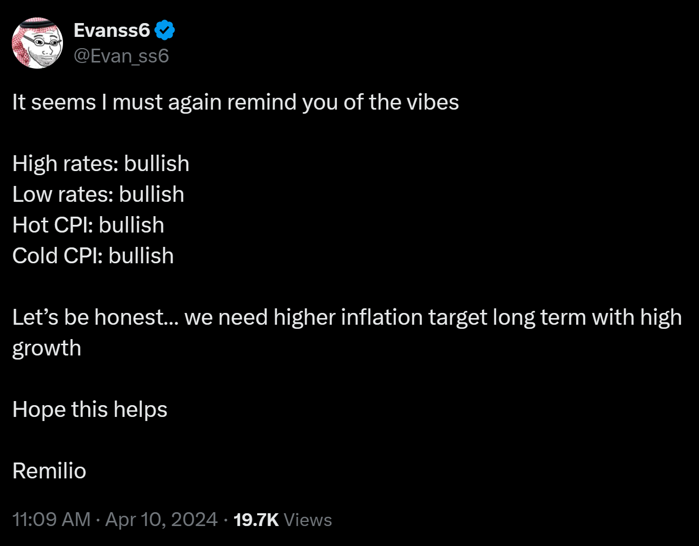
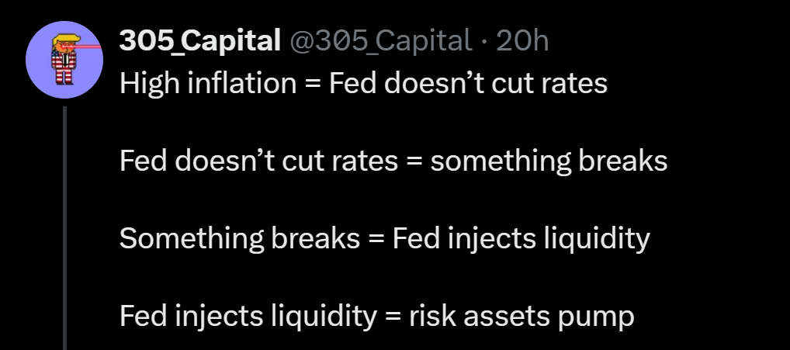

### Everything is bullish (especially for Bitcoin)

The most common Bitcoin-as-a-store-of-value pushback I read is that its price action does not follow its "digital gold" narrative. Instead of being a stock-market-uncorreleated dollar hedge like gold, it trades like a tech stock.

Because of its youth and volatility Bitcoin is considered a risk asset on steriods; something you buy when you have extra powder that you do not mind losing. If the buyer lacks a long-term thesis on the asset or just does not have enough cash in general, it will be the first asset sold when it is time to pay for things (note: do not do this -- if you are going to need to sell your most reflexive assets during a market downturn, that is very -EV and you need to reconsider your portfolio). Bitcoin trades like a risk asset because...market participants trade it like a risk asset. <u>Its price action is dominated so thoroughly by its volatility and positive correlation to risk assets that you do not notice the fiat hedge property when you look at the chart.</u>

Bitcoin-USD is an asset pair like any other. If one asset moves up, the other moves down in relation. USD is practically guaranteed to weaken significantly vs. hard assets like gold and Bitcoin over the next decade for reasons I will not elaborate on here. Instead I will leave you with this: <u>everything is bullish except for war.</u>

